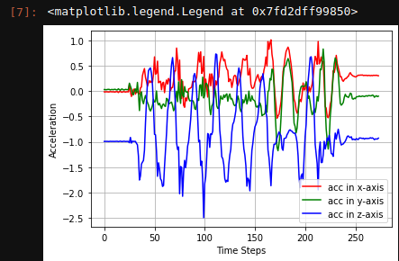

# MMR Data Collection Pipeline
This repository holds code used to stream sensor data from a [MetaMotionR](https://mbientlab.com/store/metamotionr/). It streams accelorometer and gyroscope sensor data and commits it to an Azure blob storage

## Requirements
- Python API
- Virtual Environment
- Project Packages 
- Connection string to Azure Blob Storage

## 1. Python API

- Make sure The python API is set up correctly.
    1. Linux [API Installation](https://mbientlab.com/tutorials/PyLinux.html)
    2. Windows [API Installation](https://mbientlab.com/tutorials/PyWindows.html)

## 2. Python Virtual Environment
To learn how to install and create a virtul environment check out:
<br> https://uoa-eresearch.github.io/eresearch-cookbook/recipe/2014/11/26/python-virtual-env/

## 3. Project Packages
To install required packages, run the following command after creating a virtual env.

```python
pip install -r requirements.txt
```
## 4. Connection String
- Before continuing, you need to have the connection string to the blob storage from the [Azure Portal](https://docs.microsoft.com/en-us/azure/storage/common/storage-account-create?tabs=azure-portal), [Azure PowerShell](https://docs.microsoft.com/en-us/azure/storage/common/storage-account-create?tabs=azure-powershell) or [Azure CLI](https://docs.microsoft.com/en-us/azure/storage/common/storage-account-create?tabs=azure-cli)
- To set up an Azure Blob Storage account and get a brief walk though of using blob storage you can check out this repo: https://github.com/makenasandra/azure_blob_storage


Run the following in a terminal

- Unix

```
$ export CONN_STR=pastethereallyreallylongconnectionstringhere
```
- Windows
```
$ set CONN_STR=pastethereallyreallylongconnectionstringhere
```

## Usage
- Turn on bluetooth.

- Run the following and choose an option for an exercise
```
python main.py
```
The script ```main.py``` does the following:
1. Discovers and connects to MMR sensor
2. Streams data based on time entered
3. Uploads data in form of CSV files to the Azure Blob Storage

When you run it in the terminal it will look like this:
```
Discovering nearby Bluetooth Low Energy devices...
[1] - CE:BA:F1:04:7C:D2: MetaWear
[2] - F9:E1:CD:70:81:0C:
Which device do you want to connect to? 1


Choose a number for an exercise below
    1. Standing
    2. Walking
    3. Sitting
    4. Laying Down
    3

Enter Seconds You'll do sitting:
60
Logging data for sitting

Collecting Data:         |████████████████████████████████████████| 100.0% Complete
Finished!
Sucessfully uploaded!
```
Then you can choose to continue or Exit the program
```
Continue or exit
1. Repeat
2. Exit

2
```


### Challenges you may face
1. The bluetooth may disconnect as the program is running. Just hit ```ctrl + C``` to stop program and restart again.
2. If you notice that you are collecting way less data than expected you can:  
    +Ensure the MetaWear Device is the only bluetooth device connected, disconnect any other buletooth devices conected to your laptop.
    + Update the Metawear firmware


## Querying data
To query data you can create a notebook or just run along with a script



## For More Information
For more information on the Artificial Health Assistant Project you can read our report:
<br> [HUMAN ACTIVITY RECOGNITION: MONITORING THE RECOVERY OF ORTHOPAEDIC PATIENTS](https://dekut-dsail.github.io/technical-reports.html)
