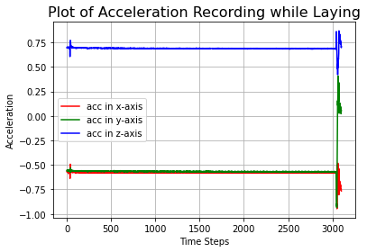
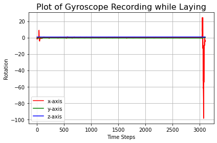
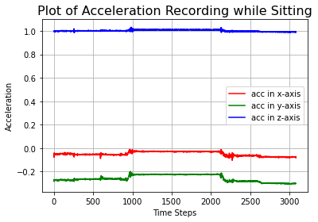
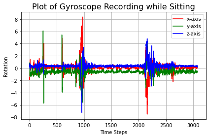
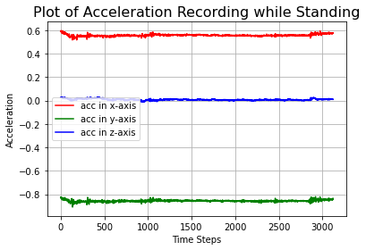
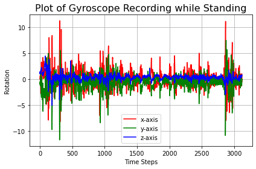
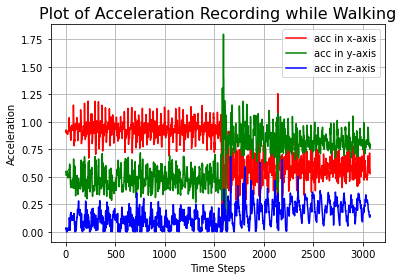
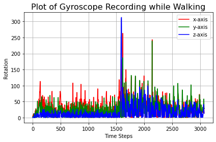

### Getting the data


```python
import pyodbc
import numpy as np
import pandas as pd
import matplotlib as mpl
import matplotlib.pyplot as plt

```


```python
# Import CSV
#Laying down
lay_acc = pd.read_csv("test_data/laying/lay1_MetaWear_2020-10-01T18.10.07.380_CEBAF1047CD2_Accelerometer_50.000Hz_1.5.0.csv") 
lay_gyr = pd.read_csv("test_data/laying/lay1_MetaWear_2020-10-01T18.10.07.380_CEBAF1047CD2_Gyroscope_50.000Hz_1.5.0.csv")
#Acceleromter
lay_acc_x = np.array(lay_acc['x-axis (g)'])
lay_acc_y = np.array(lay_acc['y-axis (g)'])
lay_acc_z = np.array(lay_acc['z-axis (g)'])
#Gyroscope
lay_gyr_x = np.array(lay_gyr['x-axis (deg/s)'])
lay_gyr_y = np.array(lay_gyr['y-axis (deg/s)'])
lay_gyr_z = np.array(lay_gyr['z-axis (deg/s)'])


#Sitting
sit_acc = pd.read_csv("test_data/sitting/sitone_MetaWear_2020-10-01T17.03.44.462_CEBAF1047CD2_Accelerometer_50.000Hz_1.5.0.csv")
sit_gyr = pd.read_csv("test_data/sitting/sitone_MetaWear_2020-10-01T17.03.44.462_CEBAF1047CD2_Gyroscope_50.000Hz_1.5.0.csv")
#Acceleromter
sit_acc_x = np.array(sit_acc['x-axis (g)'])
sit_acc_y = np.array(sit_acc['y-axis (g)'])
sit_acc_z = np.array(sit_acc['z-axis (g)'])
#Gyroscope
sit_gyr_x = np.array(sit_gyr['x-axis (deg/s)'])
sit_gyr_y = np.array(sit_gyr['y-axis (deg/s)'])
sit_gyr_z = np.array(sit_gyr['z-axis (deg/s)'])


#Standing
stand_acc = pd.read_csv("test_data/standing/stand1_MetaWear_2020-10-01T17.14.03.253_CEBAF1047CD2_Accelerometer_50.000Hz_1.5.0.csv")
stand_gyr = pd.read_csv("test_data/standing/stand1_MetaWear_2020-10-01T17.14.03.253_CEBAF1047CD2_Gyroscope_50.000Hz_1.5.0.csv")
#Acceleromter
stand_acc_x = np.array(stand_acc['x-axis (g)'])
stand_acc_y = np.array(stand_acc['y-axis (g)'])
stand_acc_z = np.array(stand_acc['z-axis (g)'])
#Gyroscope
stand_gyr_x = np.array(stand_gyr['x-axis (deg/s)'])
stand_gyr_y = np.array(stand_gyr['y-axis (deg/s)'])
stand_gyr_z = np.array(stand_gyr['z-axis (deg/s)'])

#Walking 
walk_acc = pd.read_csv("test_data/walking/walk9_MetaWear_2020-10-02T14.21.52.314_CEBAF1047CD2_Accelerometer_50.000Hz_1.5.0.csv")
walk_gyr = pd.read_csv("test_data/walking/walk9_MetaWear_2020-10-02T14.21.52.314_CEBAF1047CD2_Gyroscope_50.000Hz_1.5.0.csv")
#Acceleromter
walk_acc_x = np.array(walk_acc['x-axis (g)'])
walk_acc_y = np.array(walk_acc['y-axis (g)'])
walk_acc_z = np.array(walk_acc['z-axis (g)'])
#Gyroscope
walk_gyr_x = np.array(walk_gyr['x-axis (deg/s)'])
walk_gyr_y = np.array(walk_gyr['y-axis (deg/s)'])
walk_gyr_z = np.array(walk_gyr['z-axis (deg/s)'])

#Removing unnecessary columns 
lay_acc = lay_acc.drop(['elapsed (s)', 'time (06:00)'], axis = 1)
lay_gyr = lay_gyr.drop(['elapsed (s)', 'time (06:00)'], axis = 1)
#Acceleromter
stand_acc_x = np.array(stand_acc['x-axis (g)'])
stand_acc_y = np.array(stand_acc['y-axis (g)'])
stand_acc_z = np.array(stand_acc['z-axis (g)'])
#Gyroscope
stand_gyr_x = np.array(stand_gyr['x-axis (deg/s)'])
stand_gyr_y = np.array(stand_gyr['y-axis (deg/s)'])
stand_gyr_z = np.array(stand_gyr['z-axis (deg/s)'])

#Renaming columns
lay_acc.rename(columns = {'epoch (ms)': 'Epoch', 'x-axis (g)':'X_axis', 'y-axis (g)': 'Y_axis', 'z-axis (g)': 'Z_axis'}, inplace = True) 
lay_gyr.rename(columns = {'epoch (ms)': 'Epoch', 'x-axis (deg/s)':'X_axis', 'y-axis (deg/s)': 'Y_axis', 'z-axis (deg/s)': 'Z_axis'}, inplace = True) 

#Add activity label
lay_acc = lay_acc.assign(Label = 'laying')
lay_gyr = lay_gyr.assign(Label = 'laying')

#sit_acc.head()

```

### Let's Visualize the data


```python
%matplotlib inline

#Laying
#Accelometer Data
plt.figure()
plt.axes()
plt.plot(lay_acc_x, 'r', label='acc in x-axis')
plt.plot(lay_acc_y, 'g', label='acc in y-axis')
plt.plot(lay_acc_z, 'b', label='acc in z-axis')
plt.grid(True, which='both')
plt.title('Plot of Acceleration Recording while Laying', fontsize=16)
plt.ylabel('Acceleration')
plt.xlabel('Time Steps')
plt.legend()

#Gyroscope Data
plt.figure()
plt.axes()
plt.plot(lay_gyr_x, 'r', label='x-axis')
plt.plot(lay_acc_y, 'g', label='y-axis')
plt.plot(lay_acc_z, 'b', label='z-axis')
plt.grid(True, which='both')
plt.title('Plot of Gyroscope Recording while Laying', fontsize=16)
plt.ylabel('Rotation')
plt.xlabel('Time Steps')
plt.legend()
plt.tight_layout()


#Sitting
#Accelometer Data
plt.figure()
plt.axes()
plt.plot(sit_acc_x, 'r', label='acc in x-axis')
plt.plot(sit_acc_y, 'g', label='acc in y-axis')
plt.plot(sit_acc_z, 'b', label='acc in z-axis')
plt.grid(True, which='both')
plt.title('Plot of Acceleration Recording while Sitting', fontsize=16)
plt.ylabel('Acceleration')
plt.xlabel('Time Steps')
plt.legend()

#Gyroscope Data
plt.figure()
plt.axes()
plt.plot(sit_gyr_x, 'r', label='x-axis')
plt.plot(sit_gyr_y, 'g', label='y-axis')
plt.plot(sit_gyr_z, 'b', label='z-axis')
plt.grid(True, which='both')
plt.title('Plot of Gyroscope Recording while Sitting', fontsize=16)
plt.ylabel('Rotation')
plt.xlabel('Time Steps')
plt.legend()
plt.tight_layout()

#Standing
#Accelometer Data
plt.figure()
plt.axes()
plt.plot(stand_acc_x, 'r', label='acc in x-axis')
plt.plot(stand_acc_y, 'g', label='acc in y-axis')
plt.plot(stand_acc_z, 'b', label='acc in z-axis')
plt.grid(True, which='both')
plt.title('Plot of Acceleration Recording while Standing', fontsize=16)
plt.ylabel('Acceleration')
plt.xlabel('Time Steps')
plt.legend()

#Gyroscope Data
plt.figure()
plt.axes()
plt.plot(stand_gyr_x, 'r', label='x-axis')
plt.plot(stand_gyr_y, 'g', label='y-axis')
plt.plot(stand_gyr_z, 'b', label='z-axis')
plt.grid(True, which='both')
plt.title('Plot of Gyroscope Recording while Standing', fontsize=16)
plt.ylabel('Rotation')
plt.xlabel('Time Steps')
plt.legend()
plt.tight_layout()

#Walking
#Accelometer Data
plt.figure()
plt.axes()
plt.plot(np.absolute(walk_acc_x), 'r', label='acc in x-axis')
plt.plot(np.absolute(walk_acc_y), 'g', label='acc in y-axis')
plt.plot(np.absolute(walk_acc_z), 'b', label='acc in z-axis')
plt.grid(True, which='both')
plt.title('Plot of Acceleration Recording while Walking', fontsize=16)
plt.ylabel('Acceleration')
plt.xlabel('Time Steps')
plt.legend()

#Gyroscope Data
plt.figure()
plt.axes()
plt.plot(np.absolute(walk_gyr_x), 'r', label='x-axis')
plt.plot(np.absolute(walk_gyr_y), 'g', label='y-axis')
plt.plot(np.absolute(walk_gyr_z), 'b', label='z-axis')
plt.grid(True, which='both')
plt.title('Plot of Gyroscope Recording while Walking', fontsize=16)
plt.ylabel('Rotation')
plt.xlabel('Time Steps')
plt.legend()
plt.tight_layout()
```


    

    


    

    


    

    


    

    


    

    


    

    


    

    


    

    


```python

```
